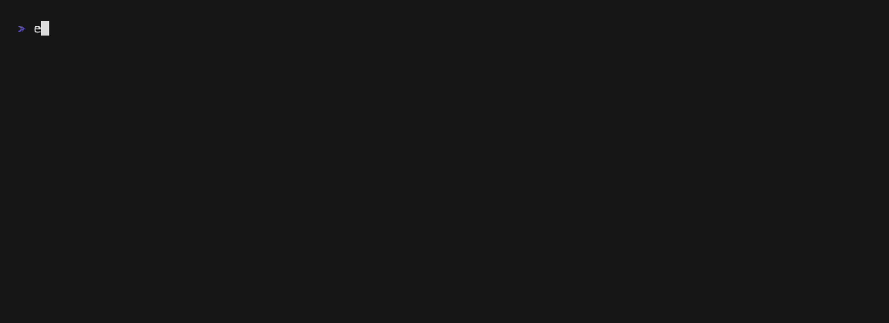

# extendo-cli

`ext` — a terminal picker for your clipboard history. Press a number, the item
is back on your pasteboard, and you are back at the prompt.



## install

```sh
brew install tjq/tap/ext
```

Or build it:

```sh
go build -o ext ./cmd/ext
```

macOS only.

## ctrl-G

```sh
ext install
```

Binds ctrl-G to the picker, so it opens over whatever you are typing. It never
types into your line — picking only puts the item on the pasteboard — and it
prints nothing, so the screen you pressed it over is the screen you get back.
Errors go on zsh's status line, which the next keystroke clears. Open a new
terminal afterwards, or `source` the file it names.

For a different chord:

```sh
ext install --key ctrl-t
```

`ctrl-t`, `^T` and `t` all name the same one. It binds ctrl plus a letter,
and refuses the few the terminal needs for itself — `ctrl-c`, `ctrl-d`,
`ctrl-z` and the rest — rather than leaving you without an interrupt.

It appends a managed block to `~/.zshrc` (zsh) or `~/.bash_profile` (bash),
between `# >>> extendo-cli >>>` markers. Re-running replaces the block rather
than adding a second, so it is safe after every upgrade, and

```sh
ext install --uninstall
```

takes it back out and leaves the rest of the file alone. `--profile <file>`
names a different file. Everything except ctrl-G works without the block.

## ctrl-G over a running program

The block above binds ctrl-G in your **shell**, so it only fires at the shell's
own prompt. At a `sudo` password prompt, in `vim`, or inside a REPL, that
program owns the terminal and the shell is blocked waiting for it — the key
goes to the program and the binding never runs. No shell binding can change
that.

tmux reads keys before the pane's program does, so bind it there instead:

```sh
ext install --tmux
```

That writes the same managed block to `~/.tmux.conf` (or
`~/.config/tmux/tmux.conf` if you keep one), binding ctrl-G to a
`display-popup` that runs the picker. The popup is a pane of its own, so
nothing is drawn on the terminal the paused program is holding and nothing is
typed into it — pick an item and you are back at the password prompt with the
item on your pasteboard, exactly as you left it. Reload with `tmux source-file
~/.tmux.conf`.

`--key` works here too, and `--tmux --uninstall` takes it back out. It needs
tmux 3.2 or newer, which is where `display-popup` arrived; `ext install
--tmux` checks first and refuses rather than writing a line that would stop
tmux reading the rest of your config. Unlike the shell block it does not care
what shell you run, so it is also the one way to get the hotkey under fish.

Both blocks can coexist — tmux sees the key first, so inside tmux it wins.
Outside tmux, your terminal emulator can do the same job:

```
# kitty.conf
map ctrl+g launch --type=overlay ext --quiet
```

`ext doctor` reports which of these you have.

## keys

The picker shows ten items a page, labelled `1..9` then `0`.

| key | action |
|---|---|
| `1`–`9`, `0` | copy that row and exit — `0` is the tenth |
| `c` | copy the highlighted row and exit |
| `↑` `↓` / `k` `j` | move the cursor |
| `←` `→` / `h` `l` | flip a page |
| `p` | pin or unpin the highlighted item |
| `d` | delete it, permanently |
| `s` | reveal a masked credential; again to hide it |
| `⏎` / `tab` | preview the highlighted item — any key returns |
| `/` | search; `⏎` keeps the filter and hands the number row back, `esc` clears it |
| `q` / `esc` | quit — `esc` clears an active filter first |
| `ctrl+c` | quit from anywhere, including the preview and the query field |

The number row acts on the row it names wherever the cursor is, so the common
case is one keystroke.

## commands

| command | |
|---|---|
| `ext` | the picker on a terminal; the `list` table when the output is piped |
| `ext list` | table of the history; `--json` for an array meant for scripts |
| `ext get <n\|id>` | copy an item; `--print` writes its text to stdout instead |
| `ext pin <n\|id>` | toggle the pin |
| `ext delete <n\|id>` | remove it (aliased `rm`) |
| `ext version` | print the version |

`<n>` is the number the list prints — pinned first, then newest — and `<id>` is
any unambiguous prefix of an item's id.

```sh
ext list
ext get 3          # back on the pasteboard
ext get 3 --print  # to stdout, byte for byte
ext list --json | jq -r '.[] | select(.pinned) | .label'
```

Confirmations go to stderr and the payload to stdout, so `ext get 3 --print`
pipes cleanly.

## flags

```sh
ext --ascii    # txt / img / fil stand-ins for the glyph columns
ext --nerd     # Nerd Font icons; needs a patched font
```

`EXTENDO_ASCII=1` and `EXTENDO_NERD=1` do the same. `NO_COLOR` turns colour
off, and `EXTENDO_STORE_DIR` points `ext` at a different history directory.

```sh
ext --quiet     # -q; no ✓ line, errors still reported
```

`--quiet` works on every command. It is what the hotkey bindings pass, so a
key pressed over something else leaves no trace on that screen; the payload of
`ext get --print` is unaffected.
